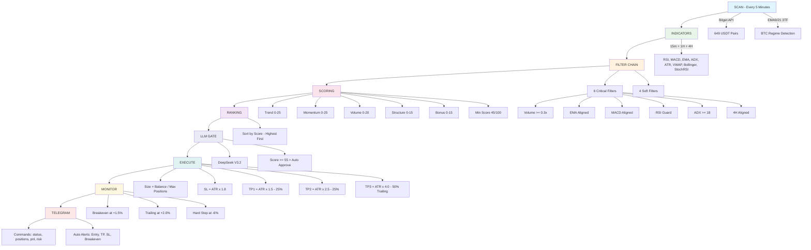

# Gacors Agent

AI-powered autonomous trading agent for Bitget USDT perpetual futures.

## Architecture



## Quick Start

```bash
git clone https://github.com/andro9999/Gacors-Agent.git
cd Gacors-Agent
npm install
cp .env.example .env
TRADING_MODE=paper node index.js
```

## Configuration

```env
TELEGRAM_BOT_TOKEN=your_bot_token
TELEGRAM_CHAT_ID=your_chat_id
TRADING_MODE=paper
```

## Features

| Component | Description |
|-----------|-------------|
| Filter Chain | 16 layers: 6 critical + 4 soft |
| Scoring | 0-100: Trend + Momentum + Volume + Structure + Bonus |
| LLM Gate | DeepSeek V3.2, bypass at score 55+ |
| SL/TP | ATR-adaptive: SL 1.8x, TP1 1.5x, TP2 2.5x, TP3 4.0x |
| Monitor | Breakeven +1.5%, trailing +2%, hard stop -6% |
| Telegram | Commands + auto notifications |
| Paper Trading | SQLite, dynamic position sizing |

## Scoring

| Component | Max | Measures |
|-----------|-----|----------|
| Trend | 25 | EMA, ADX, DI, 4H |
| Momentum | 25 | RSI, MACD, StochRSI, Fisher |
| Volume | 20 | Volume ratio, taker bias |
| Structure | 15 | Bollinger, VWAP, choppiness |
| Bonus | 15 | Confluence, squeeze, funding |

## Tech Stack

- Node.js 22+ / SQLite / Bitget API v2 / DeepSeek V3.2 / Telegram Bot

## License

MIT
